## ¿Qué es Axios?


Muchos proyectos en la web necesitan interactuar con una API REST en algún momento de su desarrollo. Axios es un cliente HTTP ligero basado en el servicio $ http dentro de Angular.js v1.x y es similar a la API de búsqueda de JavaScript nativa.

Axios se basa en promesas, lo que le brinda la capacidad de aprovechar la asincronía de JavaScript y esperar un código asincrónico más legible.

También puede interceptar y cancelar solicitudes, y hay una protección integrada en el lado del cliente contra la falsificación de solicitudes entre sitios.

En este artículo, verá ejemplos de cómo usar Axios para acceder a la popular API de marcador de posición JSON dentro de una aplicación React.

### Requisitos previos

Para seguir este artículo, necesitarás lo siguiente:

- Node.js versión 10.16.0 instalado en el equipo. Para instalar esto en macOS o Ubuntu 18.04, siga los pasos de Cómo instalar Node.js y Crear un entorno de desarrollo local en macOS o la sección Instalación utilizando un PPA de Cómo instalar Node.js en Ubuntu 18.04.
- Un nuevo proyecto de React configurado con Create React App siguiendo el tutorial Cómo configurar un proyecto de React con Create React App.
- También ayudará a tener una comprensión básica de JavaScript, que puede encontrar en la serie Cómo codificar en JavaScript, junto con un conocimiento básico de HTML y CSS.

### Adición de Axios al proyecto

En esta sección, agregará Axios a un proyecto React.

```Shell
npx create-react-app react-axios-example
```

Para agregar Axios al proyecto, abra el terminal y cambie los directorios en el proyecto:

```Shell
cd react-axios-example
```

A continuación, ejecute este comando para instalar Axios:

```Shell
npm install axios@0.24.0
```

A continuación, deberá importar Axios en el archivo en el que desea usarlo.

### Realización de una solicitud GET

En este ejemplo, se crea un nuevo componente y se importa Axios en él para enviar una solicitud GET.

Dentro de tu proyecto de React, necesitarás crear un nuevo componente llamado PersonList.

Primero, cree un nuevo subdirectorio de componentes en el directorio src:

```Shell
mkdir src/components
```

En este directorio, cree PersonList.js y agregue el siguiente código al componente:

src/components/PersonList.js

```JavaScript
import React from 'react';
import axios from 'axios';

export default class PersonList extends React.Component {
  state = {
    persons: []
  }

  componentDidMount() {
    axios.get(`https://jsonplaceholder.typicode.com/users`)
      .then(res => {
        const persons = res.data;
        this.setState({ persons });
      })
  }

  render() {
    return (
      <ul>
        {
          this.state.persons
            .map(person =>
              <li key={person.id}>{person.name}</li>
            )
        }
      </ul>
    )
  }
}
```

Primero, importa React y Axios para que ambos se puedan usar en el componente. A continuación, se conecta al enlace del ciclo de vida de componentDidMount y realiza una solicitud GET.

Utiliza axios.get (url) con una URL de un punto final de API para obtener una promesa que devuelve un objeto de respuesta. Dentro del objeto de respuesta, hay datos que luego se asignan al valor de persona.

También puede obtener otra información sobre la solicitud, como el código de estado en res.status o más información dentro de res.request.

Añade este componente a tu app.js:

src/app.js

```JavaScript
import PersonList from './components/PersonList.js';

function App() {
  return (
    <div ClassName="App">
      <PersonList/>
    </div>
  )
}
```

A continuación, ejecute la aplicación:

```Shell
npm start
```

Ver la aplicación en el navegador. Se le presentará una lista de 10 nombres.

### Realización de una solicitud POST

En este paso, utilizará Axios con otro método de solicitud HTTP denominado POST.

Dentro de tu proyecto de React, necesitarás crear un nuevo componente llamado PersonAdd.

Cree PersonAdd.js y agregue el siguiente código para crear un formulario que permita la entrada del usuario y, posteriormente, publique el contenido en una API:

src/components/PersonAdd.js

```JavaScript
import React from 'react';
import axios from 'axios';

export default class PersonAdd extends React.Component {
  state = {
    name: ''
  }

  handleChange = event => {
    this.setState({ name: event.target.value });
  }

  handleSubmit = event => {
    event.preventDefault();

    const user = {
      name: this.state.name
    };

    axios.post(`https://jsonplaceholder.typicode.com/users`, { user })
      .then(res => {
        console.log(res);
        console.log(res.data);
      })
  }

  render() {
    return (
      <div>
        <form onSubmit={this.handleSubmit}>
          <label>
            Person Name:
            <input type="text" name="name" onChange={this.handleChange} />
          </label>
          <button type="submit">Add</button>
        </form>
      </div>
    )
  }
}
```

Dentro de la función handleSubmit, se impide la acción predeterminada del formulario. A continuación, actualice el estado a la entrada del usuario.

El uso de POST le proporciona el mismo objeto de respuesta con información que puede usar dentro de una llamada.

Para completar la solicitud POST, primero debe capturar la entrada del usuario. Luego agrega la entrada junto con la solicitud POST, que le dará una respuesta. A continuación, puede console.log la respuesta, que debe mostrar la entrada de usuario en el formulario.

Añade este componente a tu app.js:

src/app.js

```JavaScript
import PersonList from './components/PersonList';
import PersonAdd from './components/PersonAdd';

function App() {
  return (
    <div ClassName="App">
      <PersonAdd/>
      <PersonList/>
    </div>
  )
}
```

A continuación, ejecute la aplicación:

```Shell
npm start
```

Ver la aplicación en el navegador. Se le presentará un formulario para enviar nuevos usuarios. Compruebe la consola después de enviar un nuevo usuario.

### Realización de una solicitud DELETE

En este ejemplo, verá cómo eliminar elementos de una API utilizando axios.delete y pasando una URL como parámetro.

Dentro de tu proyecto de React, necesitarás crear un nuevo componente llamado PersonRemove.

Cree PersonRemove.js y agregue el código siguiente para eliminar un usuario:

src/PersonRemove.js

```JavaScript
import React from 'react';
import axios from 'axios';

export default class PersonRemove extends React.Component {
  state = {
    id: ''
  }

  handleChange = event => {
    this.setState({ id: event.target.value });
  }

  handleSubmit = event => {
    event.preventDefault();

    axios.delete(`https://jsonplaceholder.typicode.com/users/${this.state.id}`)
      .then(res => {
        console.log(res);
        console.log(res.data);
      })
  }

  render() {
    return (
      <div>
        <form onSubmit={this.handleSubmit}>
          <label>
            Person ID:
            <input type="number" name="id" onChange={this.handleChange} />
          </label>
          <button type="submit">Delete</button>
        </form>
      </div>
    )
  }
}
```

De nuevo, el objeto res le proporciona información sobre la solicitud. A continuación, puede console.log esa información de nuevo después de enviar el formulario.

Añade este componente a tu app.js:

src/app.js

```JavaScript
import PersonList from './components/PersonList';
import PersonAdd from './components/PersonAdd';
import PersonRemove from './components/PersonRemove';

function App() {
  return (
    <div ClassName="App">
      <PersonAdd/>
      <PersonList/>
      <PersonRemove/>
    </div>
  )
}
```

A continuación, ejecute la aplicación:

```JavaScript
npm start
```

Ver la aplicación en el navegador. Se le presentará un formulario para eliminar usuarios.

### Uso de una instancia base en Axios

En este ejemplo, verá cómo puede configurar una instancia base en la que puede definir una dirección URL y cualquier otro elemento de configuración.

Cree un archivo independiente llamado api.js:

src/api.js

```JavaScript
import axios from 'axios';

export default axios.create({
  baseURL: `http://jsonplaceholder.typicode.com/`
});
```

Una vez configurada la instancia predeterminada, se puede utilizar dentro del componente PersonRemove. La nueva instancia se importa así:

src/components/PersonRemove.js

```JavaScript
import React from 'react';

import API from '../api';

export default class PersonRemove extends React.Component {
  // ...

  handleSubmit = event => {
    event.preventDefault();

    API.delete(`users/${this.state.id}`)
      .then(res => {
        console.log(res);
        console.log(res.data);
      })
  }

  // ...
}
```

Debido a http://jsonplaceholder.typicode.com/ ahora es la URL base, ya no necesita escribir la URL completa cada vez que desee llegar a un punto final diferente en la API.

### Usar async y await

En este ejemplo, verá cómo puede usar async y esperar a trabajar con promesas.

La palabra clave wait resuelve la promesa y devuelve el valor. El valor se puede asignar a una variable.

src/components/PersonRemove.js

```JavaScript
import React from 'react';

import API from '../api';

export default class PersonRemove extends React.Component {
  // ...

  handleSubmit = event => {
    event.preventDefault();

    const response = await API.delete(`users/${this.state.id}`);

    console.log(response);
    console.log(response.data);
  }

  // ...
}
```

En este ejemplo de código, se reemplaza el .then (). La promesa se resuelve y el valor se almacena dentro de la variable de respuesta.

## ¿Por qué es útil React Devtools?


### ¿Por qué tiene que depurar las aplicaciones React?

Depuración es una de las habilidades más útiles que un desarrollador puede tener. Permite navegar rápida y eficientemente y encontrar errores en el código. En la web moderna es posible gracias al uso de diversas herramientas y técnicas.

React es una de las bibliotecas de front-end que más rápido se desarrolla. Permite crear fácilmente interfaces de usuario complejas e interactivas. Al igual que otras bibliotecas y frameworks, tiene un conjunto de herramientas de depuración, llamadas tools de desarrollo de React.

### ¿Qué son los React DevTools?

Las Herramientas de Desarrollo de Aprox son una extensión de navegador disponible para Chrome, Firefox y como una aplicación independiente que le permite inspeccionar la jerarquía de componentes de React en las herramientas del desarrollador de Chrome. Proporciona un conjunto adicional de widgets de inspección específicos de React para ayudar en el desarrollo. Desde su creación, el equipo de desarrollo ha lanzado muchos lanzamientos.

En este material voy a demostrar varias maneras de aprovechar sus capacidades para mejorar la depuración de las aplicaciones React con él.

### Cómo instalar React DevTools

React DevTools está disponible como una extensión para Chrome y Firefox. Si ya ha instalado la extensión, debe actualizarse automáticamente. Si utiliza un shell sin conexión (por ejemplo, en React Native o Safari), puede instalar una nueva versión desde NPM:

```
npm install -g react-devtools@^4
```

### React DevTools mejora el rendimiento

DevTools ofrece importantes ganancias de rendimiento y una navegación mejorada. Algunos aspectos se han modificado para que sea fácil de usar en aplicaciones más grandes.

### Filtrado de componentes con React DevTools

En versiones anteriores de DevTools, navegar por grandes listas de componentes era un poco tedioso. Pero ahora DevTools ofrece la capacidad de filtrar componentes para ocultar aquellos que no te interesan.

Para acceder a esta función, filtremos los tres componentes.

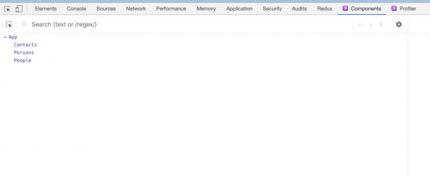

Para filtrar el componente y centrarse en el componente que nos interesa, haga clic en el icono de configuración debajo de la ficha Componentes. Aparecerá una ventana emergente delante de usted. Haga clic en la ficha Componentes y seleccione la opción de ordenación preferida.

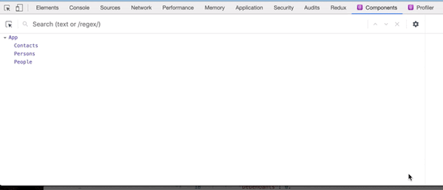

Una vez que hemos filtrado los componentes, se vuelven ocultos por defecto, pero una vez que el filtro está apagado, se vuelven visibles. Esta función es útil si está trabajando en un proyecto con muchos componentes y la clasificación rápida se convierte en una necesidad real. Lo más interesante es que la configuración del filtro se recuerda entre las sesiones de trabajo.

### Las props integradas en React DevTools son cosa del pasado

Para facilitar la visualización de grandes árboles de componentes y acelerar el funcionamiento de DevTools, los componentes del árbol ya no muestran las props integradas.

Para ver esta función en la acción, basta con seleccionar el componente y todos sus props, state y hooks aparecerán en el lado derecho de la consola.

En nuestro ejemplo de aplicación, pasamos los datos sólo al componente contacts. Al hacer clic en él, verás el valor del prop que se le ha pasado y al hacer clic en otros componentes verás que los props no se les han pasado.

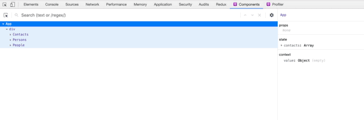

Si bien esta característica puede no ser tan útil para los pequeños proyectos React, es útil cuando se trabaja con grandes proyectos React.

### Depuración de los valores inesperados de los componentes y de los elementos de prop

Consideremos la siguiente clase React:

```JavaScript
import ABC from 'abc';
import XYZ from 'xyz';

class Main extends Component {
  constructor(props) {
    super(props);

    this.state = { name : "John" }
 }
 render() {
    const { name } = this.state;
      return (
        <ABC>
          <XYZ name={name} />
        </ABC>
      )
  }
}
```

ABC es el padre de XYZ, pero Main es el propietario del componente, y sólo los propietarios pueden enviar props hacia abajo.

En Aprox Dev, puede depurar rápidamente el valor inesperado prop saltándose a sus padres. En DevTools v4 se ha añadido una lista renderizada por el panel derecho que le permite ver rápidamente la lista de propietarios para acelerar el proceso de depuración.

Al hacer clic en cualquiera de los componentes de nuestra aplicación, podemos ver los componentes que los han mostrado. Esto es muy útil cuando se trata de rastrear el origen de un prop específico.

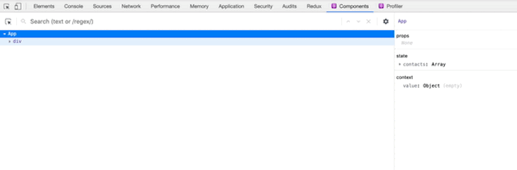

También viene con una función inversa llamada owners tree. Esta es una lista de lo que es rendido por un componente específico - lo que «posee». Esta vista es similar a ver el origen de un método de renderizado de componentes y puede ser una forma útil de explorar las grandes y desconocidas aplicaciones de React.

Para utilizar esta función para depurar la aplicación, haga doble clic en el componente para ver el árbol de propietarios y haga clic en el botón «x» para volver al árbol de componentes completo. También puede desplazarse por el árbol para ver todos los hijos del componente.

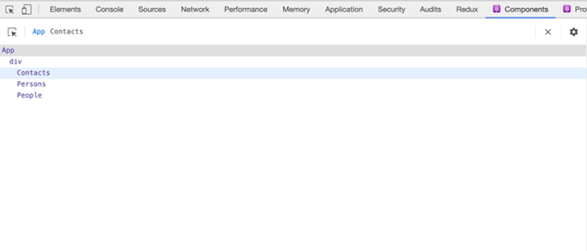

### Mejoras visuales en React DevTools

#### Representación de componentes con sangría

En versiones anteriores de React DevTools, se requería desplazamiento vertical y horizontal para ver componentes profundamente anidados, lo que dificultaba el seguimiento de grandes árboles de componentes. DevTools ahora ajusta dinámicamente las sangrías en los componentes anidados para eliminar el desplazamiento horizontal.

Para usar esta función en nuestra aplicación, haga clic en la ficha de componentes, luego haga clic en cualquier componente y todos sus componentes secundarios aparecerán automáticamente debajo de él con una sangría automática del siguiente componente.

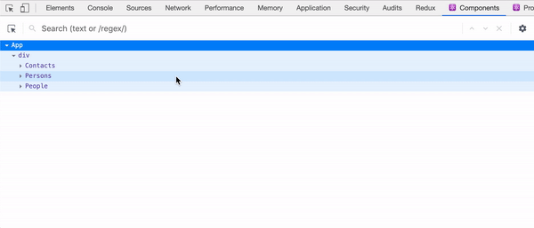

#### Búsqueda mejorada

Anteriormente, cuando se buscaba en DevTools, el resultado era a menudo un árbol de componentes filtrado que mostraba los nodos coincidentes como raíces, es decir, otros componentes estaban ocultos y la coincidencia de búsqueda ahora se mostraba como elementos raíz.

Ahora puede buscar fácilmente en sus componentes con la visualización de resultados en una línea, como una búsqueda en un navegador.

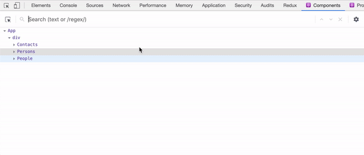

### Mejoras funcionales en React DevTools

#### Mejor soporte para hooks

Los proyectos de React basados en hooks se pueden depurar más rápido y mejor, tienen el mismo nivel de soporte que props y state.

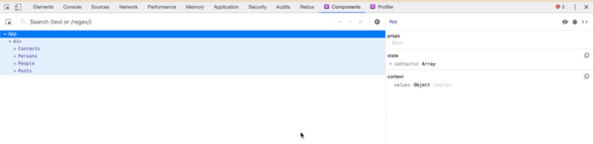

#### Restaurar selección entre reinicios

Durante la depuración, al hacer clic en el botón de reinicio, DevTools intenta restaurar el último elemento seleccionado.

Supongamos que hemos ordenado el componente Personas en nuestra aplicación de ejemplo antes de que se produzca la actualización de página, DevTools reanudará con el componente Personas seleccionado automáticamente.

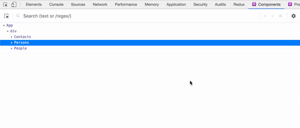

### Cambiar modo de espera

La API Suspense en React permite a los componentes «esperar» o hacer «algo» antes de renderizarse. Puede utilizar los componentes < Suspense > para determinar el estado de carga cuando los componentes situados más profundamente en el árbol están pendientes de renderizado.

DevTools le permite probar estos estados de carga con este interruptor:

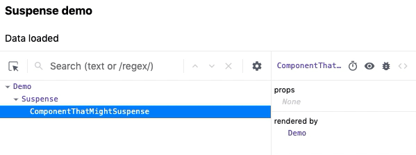

### Cambios en el profiler en React DevTools

#### Reinicio y perfil

El perfilador es una poderosa herramienta para personalizar el rendimiento de los componentes de React. Legacy DevTools era compatible con el perfilado, pero sólo después de descubrir una versión adecuada de React que soportaba el perfilado. Debido a esto, no había forma de perfilar el mount inicial (una de las partes más sensibles al rendimiento) de la aplicación.

Esta función ya se admite con la acción «reiniciar y perfilar»:

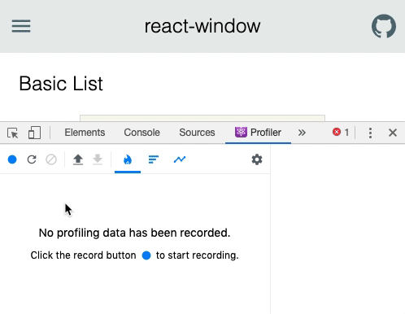

#### Lista de renders de componentes

El perfilador muestra una lista de todos los casos de renderizado del componente seleccionado durante la sesión de perfilado, así como la duración de cada renderizado. Puede utilizar esta lista para desplazarse rápidamente entre los comandos al analizar el rendimiento de componentes específicos.

Para nuestro ejemplo de aplicación, vemos que algunos componentes se muestran dos veces durante la sección, ahora tenemos una dirección de depuración que puede potencialmente mejorar el rendimiento.

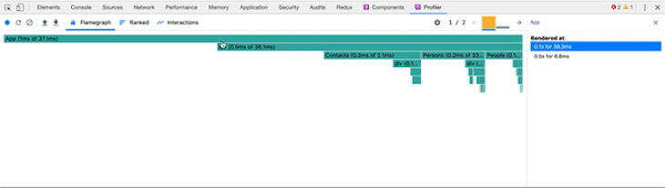

## ¿Qué es un event listener? (responde los beneficios tanto del lado del desarrollador como del cliente)

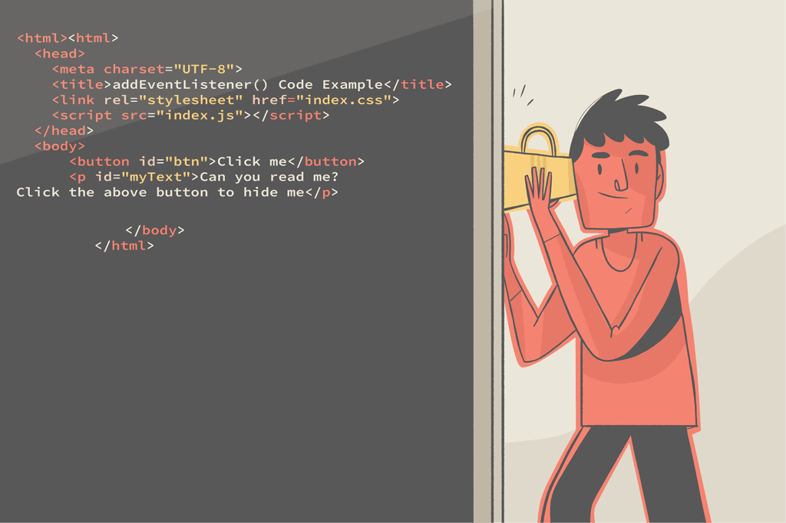

En JavaScript, un detector de eventos es un mecanismo que permite detectar eventos específicos que ocurren en elementos HTML, como clics, pulsaciones de teclas, movimientos del mouse y más. Los detectores de eventos permiten ejecutar código o activar funciones cuando ocurren esos eventos.

La sintaxis general para agregar un detector de eventos a un elemento HTML es la siguiente:

```JavaScript
element.addEventListener(event, callback);
```

- element es una referencia al elemento HTML al que desea adjuntar la escucha de eventos. Puede obtener esta referencia utilizando métodos como document.getElementById, document.querySelector o haciendo referencia directa al elemento.
- event es una cadena que representa el tipo de evento que desea escuchar, como «click», «keydown», «mouseover», etc.
- callback es una función que se ejecutará cuando se produzca el evento especificado.

A continuación se muestra un ejemplo de cómo agregar un detector de eventos a un elemento de botón para controlar un evento de clic:

HTML:

```HTML
<button id="my-button">Click Me</button>
```

JavaScript:

```JavaScript
const button = document.getElementById("my-button");
```

```JavaScript
function handleClick() {
  console.log("Button clicked!");
  // Additional code or actions
}button.addEventListener("click", handleClick);
```

En este ejemplo, obtenemos una referencia al elemento button con el id «my-button» usando document.getElementById. Definimos una función llamada handleClick que se ejecutará cuando se haga clic en el botón. Dentro de handleClick, registramos un mensaje en la consola y realizamos cualquier acción adicional según sea necesario.

Finalmente, añadimos el detector de eventos utilizando addEventListener. Pasamos la cadena «click» como evento y la función handleClick como callback. Esto indica al navegador que llame a la función handleClick siempre que se produzca un evento de clic en el botón.

Cuando se hace clic en el botón, el navegador activa el evento click y se ejecuta el código dentro de la función handleClick.

Puede utilizar detectores de eventos para responder a una amplia gama de eventos, incluidos eventos de teclado, eventos de mouse, eventos de formulario y más. El patrón de escucha de eventos le permite hacer que sus páginas web sean interactivas y responder dinámicamente a las acciones del usuario.

¡Por supuesto! Para ejecutar el código con los archivos HTML y JavaScript adecuados, siga estos pasos:

Cree un nuevo archivo HTML y asígnele un nombre index.html. Abra el archivo en un editor de texto y agregue el siguiente código:

```HTML
<!DOCTYPE html>
<html>
<head>
    <link rel="stylesheet" href="styles.css">
</head>
<body>
    <h1>Button Click Example</h1>
    <button id="my-button">Click Me</button>
    <script src="script.js"></script>
</body>
</html>
```

Guarde el archivo index.html.

Cree un nuevo archivo JavaScript llamado script.js en el mismo directorio que el archivo index.html. Abra el archivo script.js en un editor de texto y añada el siguiente código:

```JavaScript
const button = document.getElementById("my-button");
function handleClick() {
    console.log("Button clicked!");
    // Additional code or actions
}

button.addEventListener("click", handleClick);
```

Guarde el archivo script.js.

Cree un nuevo archivo CSS denominado styles.css en el mismo directorio. Este paso es opcional, pero si desea aplicar estilos personalizados a los elementos HTML, puede definirlos en este archivo.

Guarde el archivo styles.css.

Abra el archivo index.html en un navegador web haciendo doble clic en él o haciendo clic derecho y seleccionando «Abrir con» y eligiendo su navegador preferido.

La página web se abrirá, mostrando un encabezado < h1 > y un botón con la etiqueta «Haga clic en mí».

Abra las herramientas de desarrollo del navegador haciendo clic derecho en la página web y seleccionando "Inspeccionar" o'Inspeccionar elemento ".

Vaya a la pestaña «Consola» dentro de las herramientas del desarrollador.

Haga clic en el botón «Click Me» en la página web.

Verá el mensaje «¡Botón pulsado!» registrado en la consola del navegador.

Siguiendo estos pasos, puede ejecutar el código con los archivos HTML y JavaScript adecuados. Cuando se hace clic en el botón, el mensaje se registra en la consola, lo que indica que el detector de eventos funciona correctamente.